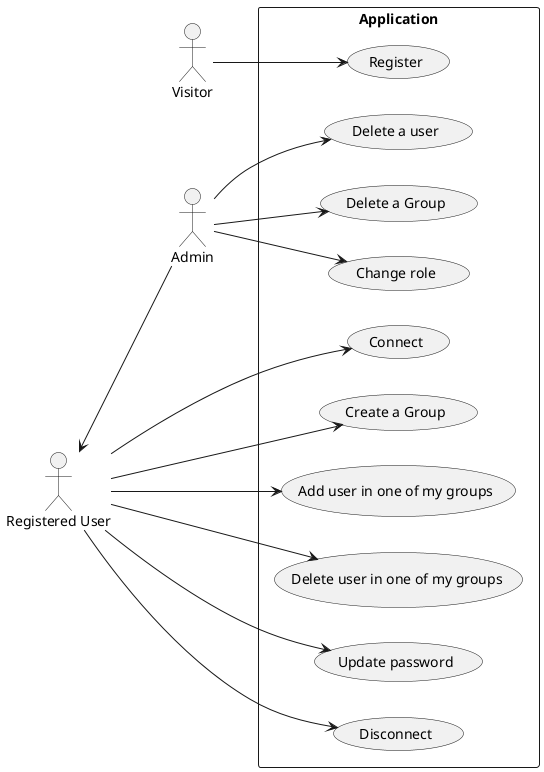
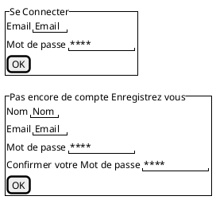
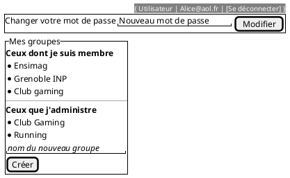
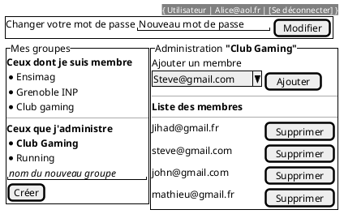
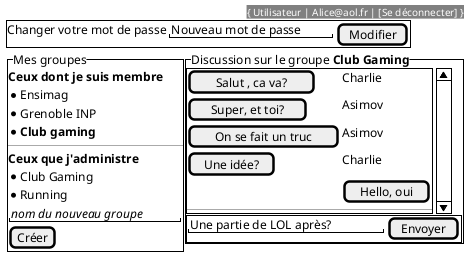
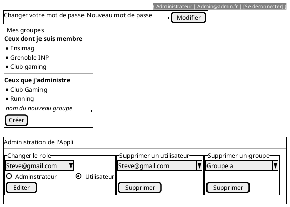

### Diagramme 1



### Diagramme 2



### Diagramme 3



### Diagramme 4



### Diagramme 5



### Diagramme 6



### Diagramme 7

```plantuml
@startsalt
<style>
header {
  TextAlignement right
  BackGroundColor gray
  FontColor white
}
</style>
header { Utilisateur | Alice@aol.fr | [Se déconnecter] }
{
  {}
}
@endsalt
```



### Diagramme 8

```plantuml
class User{
  name
  email
  passhash
  isAdmin : boolean
}

class Message{
  content
}

class Group{
  name
}

User "1" -- "n" Message : posts
Group "1" -- "n" Message : contains

User "n" -- "n"  Group : is member 
User "1" -- "n"  Group : create and own
```