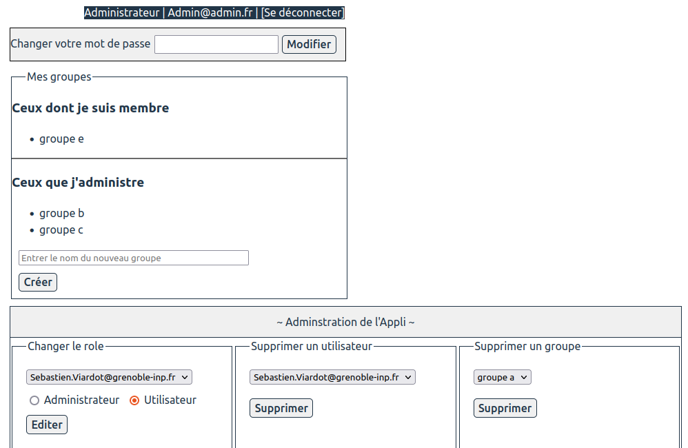

---
title: Projet React, Express and SQLite3
authors :  
- Jihad Hammoud (hammouji)
- Steve Lening (leningtz)
--- 


## Cahier des charges

Ici vous décrivez les fonctionnalités souhaitées et celles effectivement mises en oeuvre. Avec un diagramme UML des cas d'usage et des maquettes des vues souhaitées et des captures d'écran de ce qui a été réalisé.

### Cas d'usage

<div hidden>

</div>


### Maquettes

#### 1 - Interface de connexion et de création de compte


#### 2 - Interface listant les groupes


#### 3 - Interface d'administration d'un groupe


#### 4 - Interface d'envoi de messages


#### 5 - Interface d'administration de l'appli


#### 6 - Le bouton déconnexion

Il apparait en haut a droite de l'interface lorsque l'utilisateur est connecté. Si on clique dessus, on retourne a l'interface de connexion.


### Captures d'écran

#### 1 - Interface de connexion et de création de compte


#### 2 - Interface listant les groupes


#### 3 - Interface d'administration d'un groupe


#### 4 - Interface d'envoi de messages


#### 5 - Interface d'administration de l'appli


#### 6 - Le bouton déconnexion
On peut l'appercevoir sur l'image précédente en haut a droite.

### API mise en place

Lien vers la documentation swagger : https://web-project.osc-fr1.scalingo.io/doc/

## Architecture du code

### FrontEnd

Le dossier frontend est organisé de la façon suivante :

#### 1 - src/assets
Ce dossier contient tout les fichiers statiques tels que les fichiers .js contentant les styles de composants et les fichiers .css aussi.

#### 2 - src/components
Ce dossier contient tous les composants de l'application.

#### 3 - src/views
Ce dossier contient les différentes vues de notre application.

#### 4 - src
On y trouve le fichier App.jsx, son fichier css et le fichier AppContext.js qui nous permet de creer un contexte pour tous les composants enfant de App (pour mettre a leur disposition le token par exemple).

#### 5 - cypress/e2e
Ce dossier contient les fichiers de test cypress du fontend.

### Backend

#### Schéma de votre base de donnée

```plantuml
class User{
  name
  email
  passhash
  isAdmin : boolean
}

class Message{
  content
}

class Group{
  name
}

User "1" -- "n" Message : posts
Group "1" -- "n" Message : contains

User "n" -- "n"  Group : is member 
User "1" -- "n"  Group : create and own
```

#### Architecture de votre code

Le backend quant a lui est organisé en plusieurs dossiers :

#### 1 - src/frontend
Conetenant les fichiers statiques du frontend généré avec la commande npm run build et copié a partir du dossier frontend/dist.

#### 2 - src/__tests__
Ce dossier contient les tests du backend, répartie selon les tables de la base de données concernées. On n'a notamment un fichier par table de la base de données (user, group et message).

### 3 - src/controlleur
Les controlleurs sont repartie dans des fichiers en fonction de la table de la base données concerné, on a donc un fichier user.js qui contient les controlleur en rapport avec le modele user, et pareil pour les modeles group et message.

### 4 - src/models
Il contient les fichiers user.js, group.js et message.js contenant respectivement les modeles de la table user, group et message.

### 5 - src/routes
Les routes sont regroupé selon la table de la base de données qu'ils affectent, on a donc les routes en rapport avec les utilisateurs qui sont dans un fichier user.js et pareil pour les groupes et les messages.

### Gestion des rôles et droits

#### Coté backend : 
* Au départ, il y'a un seul administrateur dans la base de données et celui ci peut changer le role d'autres utilisateurs enregistrés pour qu'ils deviennent a leur tour administrateurs.
* Lors de la création d'un compte, le nouvel utilisateur est par défaut un simple utilisateur. Il ne peut devenir administrateur que si un autre administrateur change son role. 
* Nous disposons d'un middleware permettant de vérifier que toutes les requetes faites derriere la route $BACKEND/api/ contiennent un token dans les parametres de la requete.

#### Coté frontend : 
* Il y'a une vue pour l'utilisateur et une vue différente pour l'adminstrateur qui inclue une section nommée "Administration de l'Appli" qui lui permet de changer le role d'un utilisateur, de supprimer un utilisateur et de supprimer un groupe.
* Le token est concervé dans un contexte react afin de verifier en permanence que l'utilisateur a le droit d'acceder a l'applicaiton, lorsque le token devient invalide, l'utilisateur est automatiquement déconnecté.

## Test

### Backend

Nous avons écrit des tests unitaires dans trois fichiers api.user.test.js, api.group.test.js et api.messages.test.js qui contiennent respectivement les tests sur les utilisateurs, les groupes et les messages.

Pour chaque table de la base de données, nous avons testé chacune des routes disponibles sur notre api. Le fichier api.user.test.js par exemple contient les tests des routes en rapport avec les utilisateurs. C'est pareil pour les groupes et les messages dont les tests sont ecrit dans des fichiers de test dédiés.

Les tests unitaires que nous avons écrit couvrent environ 82% du backend comme le montre cette capture d'écran des tests exécutés sur le backend :


### Frontend

Nous avons écrit des tests cypress dans trois fichiers :
* 1register.cy.js : 
Contient le test d'enregistrement de compte.
* 3deleteUser.cy.js : 
Contient le test de suppression d'un utilisateur.
* 2otherTests.cy.js : 
Contient tous les autres tests.

Ces trois fichiers permettent de tester toutes les fonctionnalités de l'application sauf le changement de role d'un utilisateur. 

Les tests sont écrits suivant un sénario particulier :
- On créé d'abord un compte
- On se connecte avec ce compte
- On créé un groupe
- On ajoute un membre a un groupe
- On supprime un membre du groupe
- On envoi un message dans un groupe

- ... etc

- A la fin du test, on supprime le compte de test en utilisation le compte administrateur.


## Intégration + déploiement (/3)

Pour l'intégration continue, notre fichier gitlab-ci est contitué de 04 parties (jobs)
* Les tests du backend (on utilise notamment la commande npm run tests pour se executer les tests du backend)
* Les tests du frontend (on demarre un serveur temporaire et on execute npx cypress run)
* La mise en production du frontend (on crée un dossier public, on fait npm run build et on copie le contenu du dossier dist dans le dossier public)
* L'exposition de l'API sur scalingo (on ecrit un script permettant de de mettre a jours le backend déployé sur scalingo)

Pour plus de précisions, consultez notre fichier .gitlab-ci.yml .

## Installation

### 1 - Télechargement du dépot :
Telechargez le contenu du projet sur gitlab

### 2 - Installation du backend :
- Ouvrir le terminal "Ctrl + Alt + T"
- Deplacez vous vers le dossier contenant le projet "cd chemin_vers_dossier_projet"
- Déplacez vous dans le dossier backend "cd backend"
- Installez les dépendances "npm i"
- Lancer le serveur "npm run start"

### 3 - Installation du frontend :
- Ouvrir un autre terminal "Ctrl + Alt + T"
- Deplacez vous vers le dossier contenant le projet "cd chemin_vers_dossier_projet"
- Déplacez vous dans le dossier frontend "cd frontend"
- Installez les dépendances "npm i"
- Lancer le serveur "npm run dev"
- Ouvrir le navigateur et aller a l'adresse "http://localhost:5173/"

Vous pouvez maintenant manipuler l'application.

NB : le backend utilisé dépend de la version du projet que vous avez téléchargé. Au départ, il s'agira du backend qui est en local, mais a partir d'une certaine version, ce sera le backend qui est déployé sur scalingo.

## Déploiement

### 1 - Déploiement combiné du backend et du frontend

Le backend et le frontend ont été déployés sur scalingo via un job dans le fichier .gitlab-ci.yml . Voici le lien pour accéder à l'application sur scalingo : https://web-project.osc-fr1.scalingo.io/frontend/ .

### 2 - Déploiement séparé du frontend

Le frontend a aussi  été déployé sur les pages du projet gitlab via un job dans le fichier .gitlab-ci.yml . Voici le lien pour accéder à l'application : https://tp5-6-backend-react-jihad-hammoud-zidane-steve-l-ad43b83061cf68.pages.ensimag.fr/

### 3 - Fonctionnalites a disposition sur les versions online

Les versions déployées contiennent exactement les mêmes fonctionnalités que la version en local. On peut accéder aux fonctionnalités de l'api en utilisant https://web-project.osc-fr1.scalingo.io/end_point, il faut remplacer end_point par le end_point auquel on veut accéder. Pour avoir par exemple le token on peut faire un POST à l'adresse https://web-project.osc-fr1.scalingo.io/login avec l'email et le password.

## Requête pour accéder a TOKEN en utilisant [email,password]'

```
  const url = "localhost:3000/login";
	const fetchBody = new URLSearchParams();
	fetchBody.append("data", '{"email":"'+email+' , "password"'+password+'"}');

	fetch(url, {
		method:"POST",
		headers: {
			"Accept": "*/*",
			"Content-type":"application/x-www-form-urlencoded"
		},
		body: fetchBody.toString()
	})
	.then((res)=>{
        TOKEN=res;
	})
	.catch(error => { console.error("An error occured") });
```

## Limites du projet 

- Nous n'avons pas implémenté les websockets dans le cadre de ce projet, mais au vu de la facon dont le code est structuré, il est possible de le faire sans trop de difficultés.
- Aussi, l'application n'est pas responsive, c'est-à-dire qu'elle s'adapte tres mal aux petits écrans. Nous recommandons de visualiser l'application sur un écran d'ordinateur.